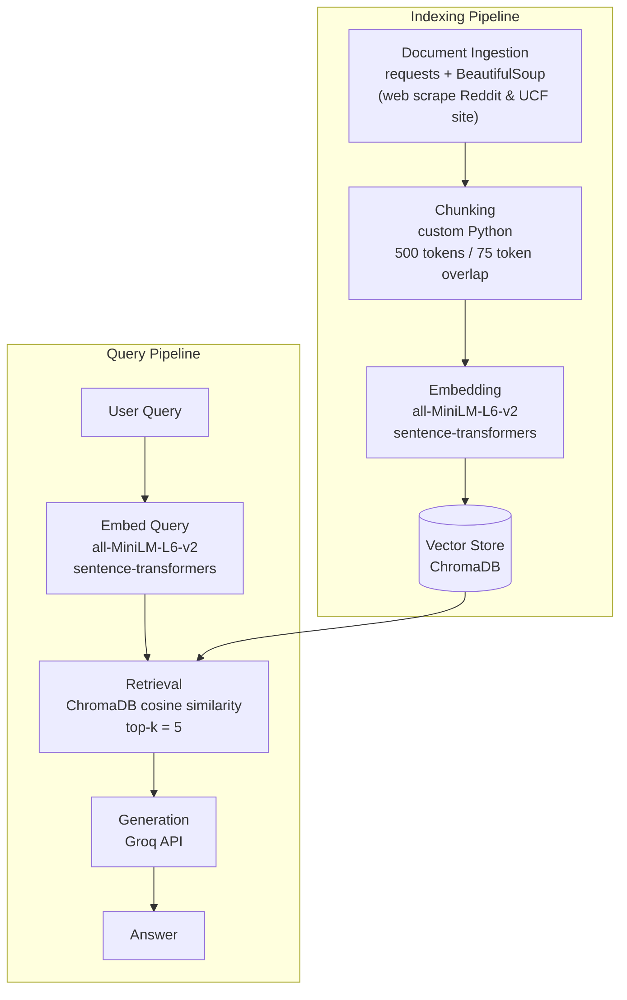

# Project 1 Planning: The Unofficial Guide

> Write this document before you write any pipeline code.
> Your spec and architecture diagram are what you'll use to direct AI tools (Claude, Copilot, etc.) to generate your implementation — the more specific they are, the more useful the generated code will be.
> Update the Retrieval Approach and Chunking Strategy sections if you change your approach during implementation.
> Update this file before starting any stretch features.

---

## Domain

<!-- What domain did you choose? Why is this knowledge valuable and hard to find through official channels? -->
The domain chosen is off-campus housing options and reviews (UCF). This knowledge is valuable to new (transfer) students or students transferring out of campus housing, to allow them to make an informed decision and to have the best experience possible. Whilst UCF offers a list of off-campus options, it does not provide further information or reviews. 

---

## Documents

<!-- List your specific sources: URLs, subreddit names, forum threads, or file descriptions.
     Aim for at least 10 sources that together cover different subtopics or perspectives within your domain. -->

| # | Source | Description | URL or location |
|---|--------|-------------|-----------------|
| 1 | UCF Website | List of Off-Campus shuttle routes and corresponding off-campus housing stops|https://parking.ucf.edu/transportation/off-campus/  | 
| 2 | Unofficial UCF Reddit | Post about the experience of looking for off-campus housing and not finding a good option, comments share experiences and recommendations | https://www.reddit.com/r/ucf/comments/1i1bv63/why_does_ucf_not_have_any_good_apartment_options/ |
| 3 | Unofficial UCF Reddit | Post about worst housing experiences, commments explore different points of view and experiences at particular places| https://www.reddit.com/r/ucf/comments/1agryxz/whats_the_worst_housing_in_the_ucf_area/ |
| 4 | Unofficial UCF Reddit | Post asking for off-campus housing horror stories, comments mention experiences (some mentioning places/complexes names) | https://www.reddit.com/r/ucf/comments/1tgsx72/please_tell_me_your_offcampus_housing_horror/ |
| 5 | Unofficial UCF Reddit | Post asking about best off-campus complexes, comments talk about pricing and experiences | https://www.reddit.com/r/ucf/comments/1r2n0ud/best_off_campus_complexes/ |
| 6 | Unofficial UCF Reddit | Post from a year ago asking about best housing options, comments share both good and bad experiences in multiple places | https://www.reddit.com/r/ucf/comments/1e7dmvz/best_offcampus_housing/ |
| 7 | Unofficial UCF Reddit | Post asking about on-campus vs off-campus for freshman year | https://www.reddit.com/r/ucf/comments/1gu04yt/on_or_off_campus_housing/ |
| 8 | Unofficial UCF Reddit | Post asking about experiences between 3 off-campus options (Mercury 3100, Lofts, Hub), comments expand on them but also suggest others | https://www.reddit.com/r/ucf/comments/1kohehb/which_off_campus_housing_should_i_move_in/ |
| 9 | Unofficial UCF Reddit | Recent post about affordable off campus options (less than 1k)| https://www.reddit.com/r/ucf/comments/1qmomqs/off_campus_housing/ |
| 10 | Unofficial UCF Reddit | Post asking about how off-campus shuttles work, comments explain and share experiences | https://www.reddit.com/r/ucf/comments/p63pou/how_does_offcampus_shuttles_work/ |

---

## Chunking Strategy

<!-- How will you split documents into chunks?
     State your chunk size (in tokens or characters), overlap size, and explain why those
     numbers fit the structure of your documents.
     A review-heavy corpus warrants different chunking than a long FAQ. -->

**Chunk size:** 250 tokens

**Overlap:** 50 tokens

**Reasoning:** 250 tokens to capture 1-2 comments and gain enough context, overlap of 50 tokens, around 1-2 sentences to cover cass of long comments.

---

## Retrieval Approach

<!-- Which embedding model are you using (e.g., all-MiniLM-L6-v2 via sentence-transformers)?
     How many chunks will you retrieve per query (top-k)?
     If you were deploying this for real users and cost wasn't a constraint, what tradeoffs
     would you weigh in choosing a different embedding model — context length, multilingual
     support, accuracy on domain-specific text, latency? -->

**Embedding model:** `all-MiniLM-L6-v2` via sentence-transformers. Fast, free to run locally, and works well for short English text like Reddit comments.

**Top-k:** 5. Each chunk is small (1–3 comments), so pulling 5 gives enough variety to cover different apartments or opinions without overloading the LLM.

**Production tradeoff reflection:** 
`all-MiniLM-L6-v2` is fast and free but cuts off at 256 words and only works in English. For real users I would switch to something like `text-embedding-3-large` since it can handle longer text and is more accurate on specific terms, but it costs money and is slower. Since all my sources are in English, multilingual support isn't a concern at the moment.

---

## Evaluation Plan

<!-- List your 5 test questions with their expected correct answers.
     Questions should be specific enough that you can judge whether the system's response
     is right or wrong. "What are good dining halls?" is too vague.
     "What do students say about wait times at [dining hall name] during lunch?" is testable. -->

| # | Question | Expected answer |
|---|----------|-----------------|
| 1 | What complexes do students recommend for someone in a budget (under 1000)? | The Pointe, Knights Circle, Mercury 3100, Orion at Orpington, Tivoli|
| 2 | What complexes do students say have bad management/maintenance/rooms/etc? | Arden Villas, Retreat west, The verge, the Quad, Northgate, Knights Circle, Campus Crossings|
| 3 | What complexes have shuttles to UCF? | Knights Circle, College Station, Boardwalk, The Verge, Aves at Twelve100, Lark Central Florida, Mercury 3100, Campus Crossings, Nine at Central, Village at Science Drive, Knights Landing, Northgate Lakes, Tivoli, Northview, The Pointe at Central, Riverwind at Alafaya, The Station, Plaza on University, Accolade East and West, Arden Villas, The Lofts, Orion at Orpington |
| 4 | What housing option do students recommend for first years/freshman? | Students recommend on-campus housing for first years. |
| 5 | What do students say about Mercury 3100? | Students mention it is affordable, but 'dirty' with weird smell, has good rates but quality is low |

---

## Anticipated Challenges

<!-- What could go wrong? Name at least two specific risks with reasoning.
     Consider: noisy or inconsistent documents, missing source attribution, off-topic
     retrieval, chunks that split key information across boundaries. -->

1. Chunks that split information across boundaries, given Reddit comments length can vary (some answers are more detailed than others).

2. Some comments in the Reddit posts might add noisy data (for example, someone talking about a different topic, or talking about their experience but not mentioning where).

---

## Architecture

<!-- Draw a diagram of your pipeline showing the five stages:
     Document Ingestion → Chunking → Embedding + Vector Store → Retrieval → Generation
     Label each stage with the tool or library you're using.
     You can use ASCII art, a Mermaid diagram, or embed a sketch as an image.
     You'll use this diagram as context when prompting AI tools to implement each stage. -->

---

## AI Tool Plan

<!-- For each part of the pipeline below, describe:
     - Which AI tool you plan to use (Claude, Copilot, ChatGPT, etc.)
     - What you'll give it as input (which sections of this planning.md, which requirements)
     - What you expect it to produce
     - How you'll verify the output matches your spec

     "I'll use AI to help me code" is not a plan.
     "I'll give Claude my Chunking Strategy section and ask it to implement chunk_text()
     with my specified chunk size and overlap" is a plan. -->

**Milestone 3 — Ingestion and chunking:**
- **Tool:** Claude
- **Input:** The Chunking Strategy section (250 tokens, 50 overlap) + the documents folder structure
- **Expected output:** An ingest.py with functions to load txt files and split to chunks
- **Verification:** Print 5 random chunks and check they are readable, non-empty, have no HTML artifacts, else debug before moving on

**Milestone 4 — Embedding and retrieval:**
- **Tool:** Claude
- **Input:** The Retrieval Approach section (model: all-MiniLM-L6-v2, top-k: 5) and chunk output from milestone 3
- **Expected output:** An embed.py that embeds all chunks with sentence-transformers and stores them in ChromaDB, plus a query() function that returns top-5 most similar chunks for a given input string
- **Verification:** Run a couple of my evaluation questions through query() and check that the returned chunks are actually related to what is asked and check distance scores are less than 0.5

**Milestone 5 — Generation and interface:**
- **Tool:** Claude
- **Input:** The Retrieval Approach section and description of the grounding requirement (LLM must answer from retrieved chunks, not general knowledge)  
- **Expected output:** An app.py that takes a user query, retrieves top-5 chunks from ChromaDB, passes them to the Groq API (with system restricting answers to given context) and shows the answer plus source documents
- **Verification:** Run all evaluation questions and check answers cite sources. Ask something off-topic and confirm it doesn't make things up.
